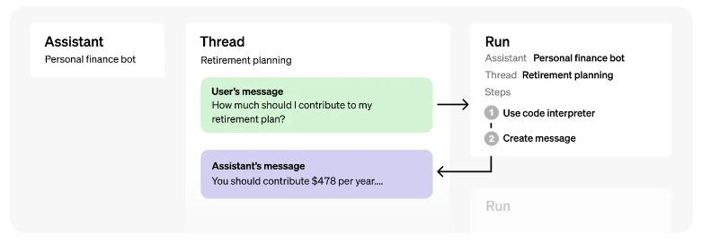

# AI Project : Assistants API

## Overview
GPT에 Assistants API(이하 : Ast)를 붙여서 특정분야에 전문화된 작업을 효율적으로 진행할 수 있다.
(이를테면 GPT들은 숫자에 아주 약하다.)
Categoty : `AI`, `API`

## Flow

- 잘 보면, GPT가 매 입력시마다 요청을 보내는 것에 반해, Ast는 입력 후 특별히 '실행(run)'을 해줘야 한다. 
기본 GPT에서 일련의 가공작업을 거쳐서, 필요한 부분만을 가공/선별에서 Ast에 던지는 구조인 것 같다. 
Ast의 이용비용은 tool마다 다르지만, 기본적으로 GPT3.5-turbo 기준 30배가 더 비싸고, 느리다.
베타라는 것을 감안해도 반응이 기민하지 않다. (당연하지만) 최종사용자와의 직접 연결하는 용도는 아니다.

## Resources

## Issue
[] 요청을 던지고 나서 결과가 나올때까지 반복적으로 찔러보는 기능 추가.

## Tips
